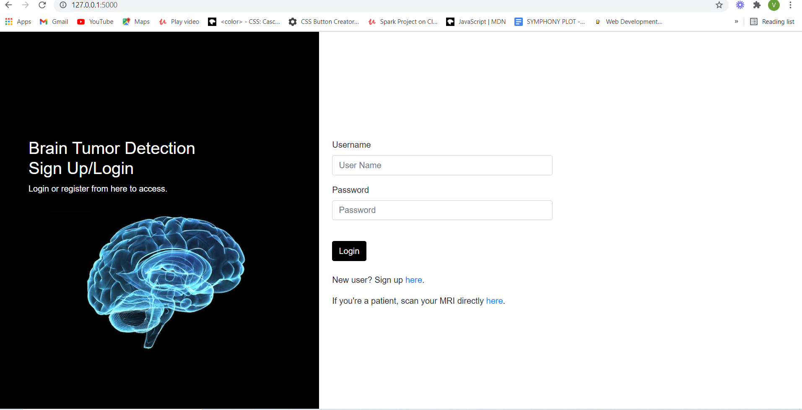
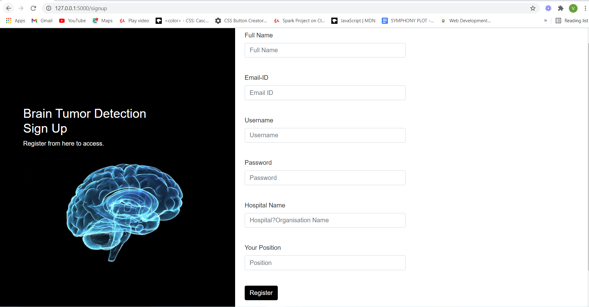
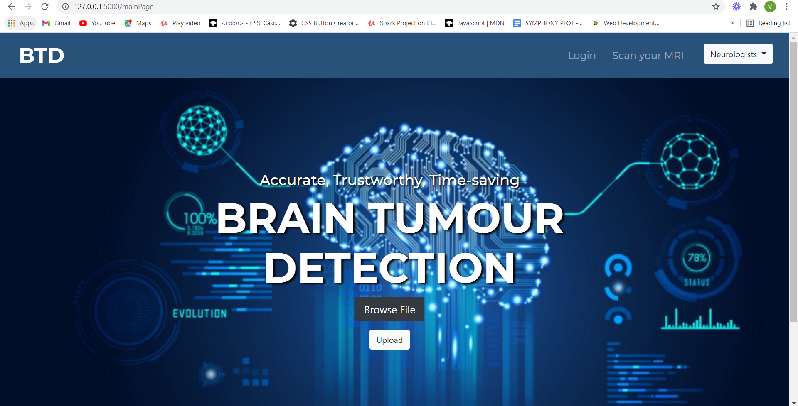
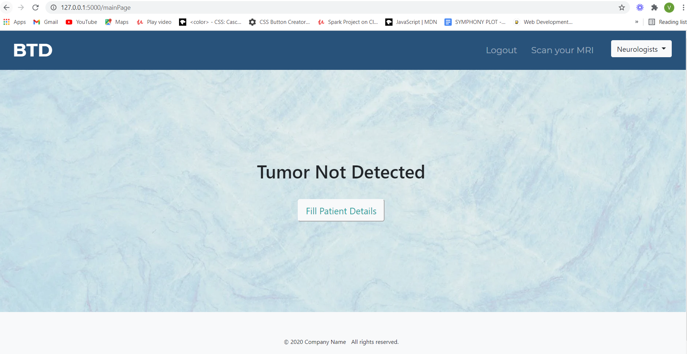
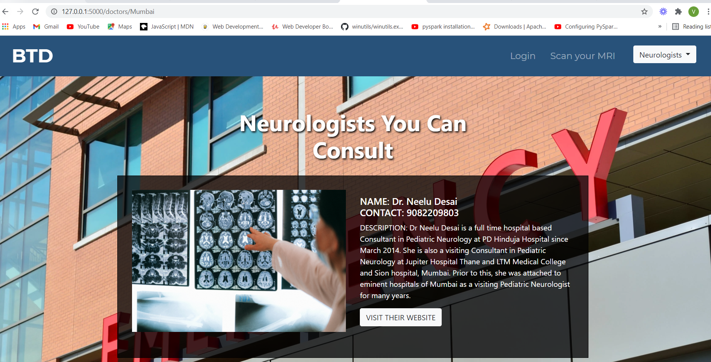
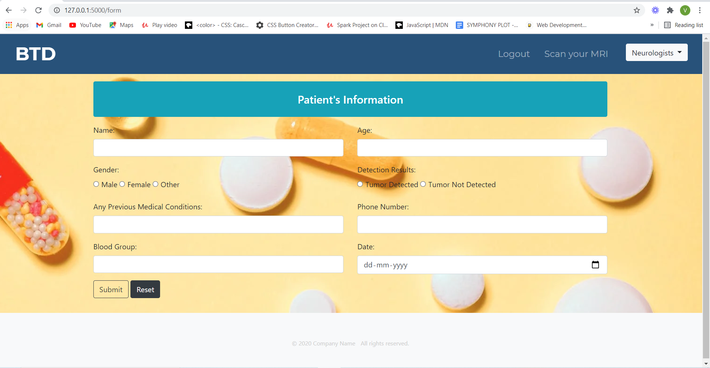
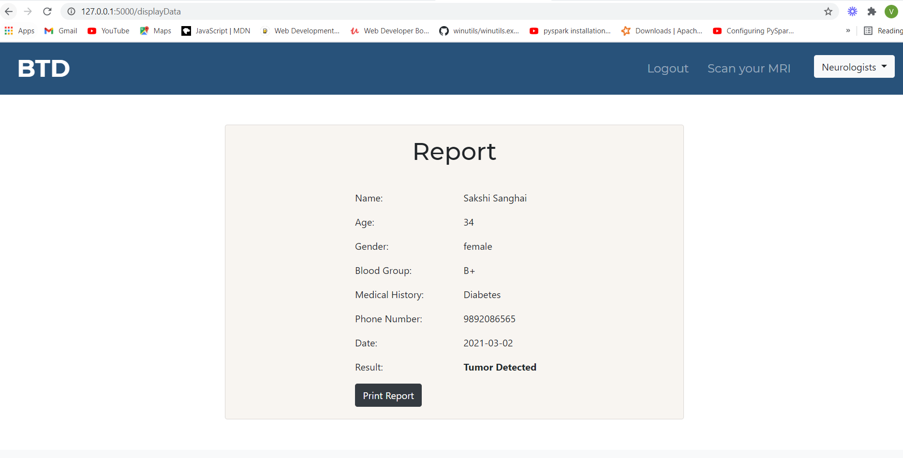

<h1 align="center">Brain Tumor Detection</h1>

 

 

 

---
<h2><strong>About</h2></strong>

Diagnosis of brain tumors in the early stages of the tumor’s start is difficult because it cannot accurately measure the size and resolution of the tumor. Therefore, the treatment of tumor depends on the timely diagnosis of the tumor. For skilled radiologists, analysis of multimodal MRI scans can take up to 20 minutes. 

Because manual image feature extraction methods are very time inefficient, limited to operator experience, and are prone to human error, a reliable and fully automatic classification method using MRI data is necessary for efficient cancer detection. 
  

Through our website 'BTD', we can precisely automate the process of detecting whether a brain tumor is present in a patient or not, while simultaneously accompanying it with an easy-to-use user interface (for the doctor + patient), hospitals and patients will be able to simplify their workflow for detecting anomalies much earlier and will be able to capture it with precision without having to sacrifice accuracy. This automated detection technique leads to accurate, efficient and cost-effective detection of brain tumors whilst alleviating the bottleneck of limited diagnosis time for doctors.  

<strong>Link to Backend Model:</strong>
https://drive.google.com/file/d/1MOhTLmoFG5is1TzgxSKO5WUJf9GJ-k99/view?usp=sharing

 

---

<h2><strong>Features</h2></strong>

* Sign-Up/Login for Doctors/Hospital Staff

* Scan MRI Images for Detection Results​

* List of Top Neurologists (Delhi, Mumbai, Bangalore, Ahmedabad) for Patients' Reference   ​

* Form to Fill Patient Details and Store Detection Results 

* Print Results

 

---

<h2><strong>Workflow</h2></strong>

  

---

<h2><strong>Screenshots</strong></h2>
 

<h3>Login Page</h3>

  
<h3>Sign-Up Page</h3>

  
<h3>Home Page</h3>

  
<h3>Results Page</h3>

  
<h3>Neurologists Page</h3>

  
<h3>Form Page</h3>

  
<h3>Report Page</h3>

  

---

 
<h2 align="center"><b>DEVELOPED BY</b></h2> 

 
